# Mission 2
## SushiFast

### Diagramme de cas d'utilisation

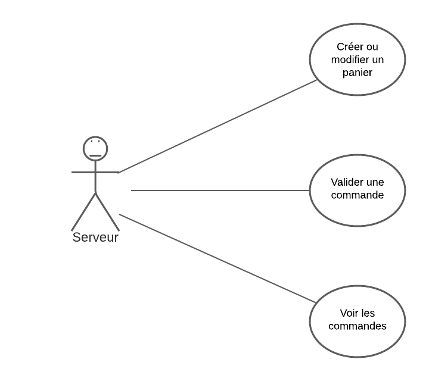
Dans ce diagramme de cas d'utilisation, nous pouvons apercevoir 3 cas d'utilisations. Le serveur qui prends les commandes des client peut effectuer 3 actions. Il peut créer où modifier un panier, il peut ensuite valider le panier qui va se transformer en commande, enfin il peut voir l'historiques des commandes.


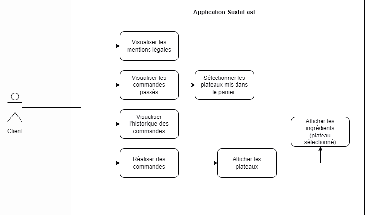

### Diagramme de séquence
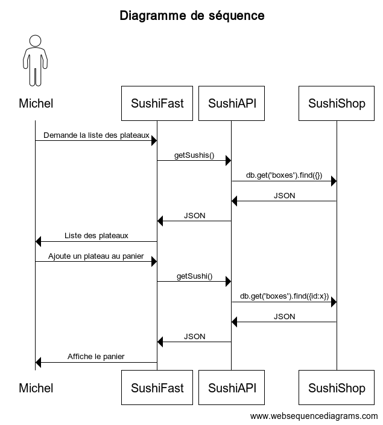

### Les tests

Le test ci-dessous vient à créer le composant 'RgpdComponent' est retouner 'true' dans le cas où le test a été un succès.
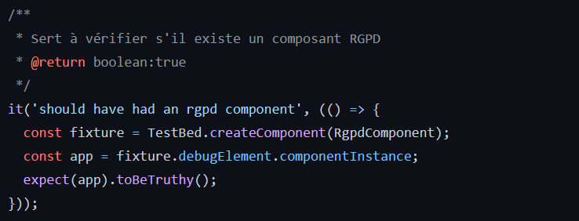

Le test 'should have had the title' vient vérifier le contenu de l'élément ayant pour id 'title'. Si celui-ci vient à correspondre à 'Mentions Légales' alors le test sera un succès.
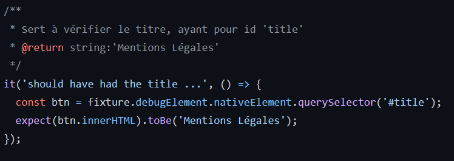

Enfin le dernier test, vient quant à lui vérifier le contenu de la feuille de style (CSS) du composant (ici 'RgpdComponent') afin de s'assurer que pour les balises `<div>`, il n'y ait de 'padding'.
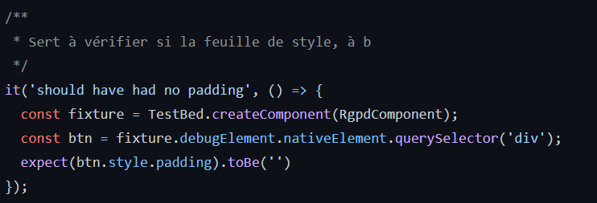

##
### Requete API
SushiFast est une application FrontEnd qui envoie des requetes sur l'API sushiAPI.


```
//SushiFast
// Fonction qui interroge le Backend SushiAPI et qui retourne tout les plateaux
getSushis(): Observable<any> {
return this.http.get<any>(urlrest + '/boxes').pipe(
  catchError(this.handleError)
  );
}
```
```
//SushiAPI
// Fonction appelée par SushiFast qui interroge la base de donnée SushiBoxes et qui retourne tout les plateaux
router.get('/', function (req, res) {
  res.setHeader('Access-Control-Allow-Origin', '*');
  var db = req.db;
  var collection = db.get('boxes');
  collection.find({}, function (e, listeBoxes) {
    res.send(listeBoxes);
  });
```


Les plateaux commandé seront sauvegardé sur le client, dans le localstorage. Le fichier json stocké dans le client aura cette structure: 
```
  Commande = [
    {nomClient: string, prenomClient: string}=>[{id: int, nom: string, prix: float}]]
  ];
```

### Affichage des plateaux

La fonction ci-dessous appelle le service et stocke la liste des plateaux dans la variable 'sushi'.
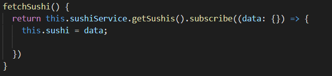

On affiche ensuite ces plateaux grâce à une boucle qui parcours 'sushi' dans 'menu.component.html'
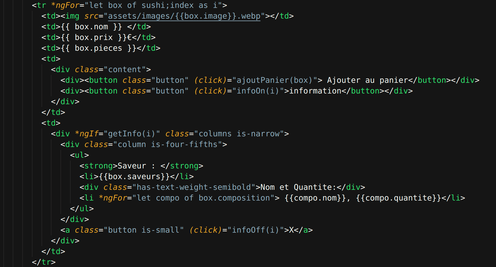


Ce qui donne le résultat suivant:
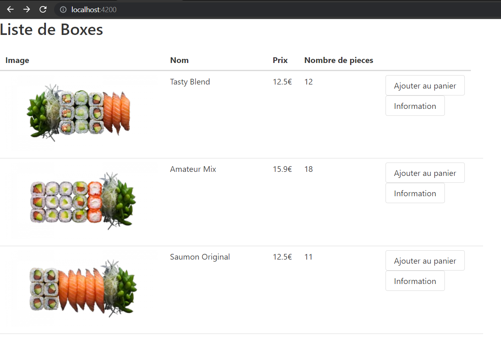

A droite de chaque plateau, il y a un bouton 'information', qui lorsqu'on clique dessus, il affiche les informations supplémentaires du plateau (Saveur, nom et quantité des composants).
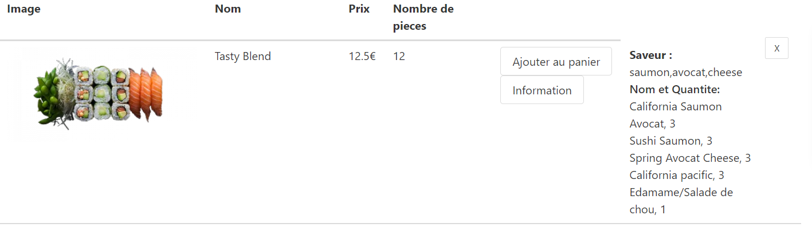


### Ajout au panier
A droite de chaque plateau, il y a un autre bouton qui s'appelle 'Ajouter au panier'. Le bouton appelle la fonction 'ajoutPanier()' quand on clique dessus.
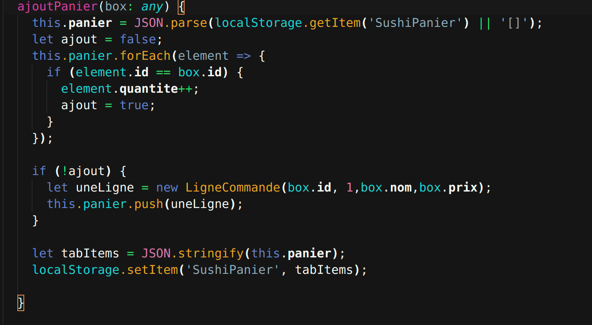
La fonction

### Valider le panier


### Historique commande

## Evènements redoutés

| Numéro de l'évènement | Evènement | Impact pour l'entreprise | Gravité |
| :---: | :------: | :------: | :---: |
| 1 | Les données sensibles n'expire pas. | Perte financière pour l'entreprise + Problème de confiance. | ** |
| 2 | L'API est saturée (DDOS). | Perte financière pour l'entreprise. | ** |

\* : modérée

** : très élevée

## EvilUS

1. Premier EvilUS

**En tant que personne malveillante**, je veux avoir accès aux données de l'utilisateur afin d'exploiter ces données (bancaires par exemple).

**Contre-mesure** :

En tant que développeur, afin d'empêcher des personnes malveillantes qui souhaitent, à partir de l'ordinateur d'un client prendre connaissance des données personnelles et sensibles sur celle-ci. J'assure une expiration des données. Pour cela, je change le data store localStorage par sessionStorage qui assure une expiration des données à la fin de session.

PS : **Cette modification n'a pas été apporté étant donnée que le projet, demandait l'usage explicite de localStorage malgré le risque potentiel**.

2. Deuxième EvilUS

**En tant que personne malveillante**, je souhaite perturber le fonctionne du site web et de leurs activités, réalisant une attaque par déni de services via l'API de la base de données.

**Contre-mesure** :

**En tant que développeur**, afin d'empêcher des personnes malveillantes qui souhaitent, à partir de l'API réalisé une attaque par déni de service. Je sécurise l'API en limitant le traffic et la taille de la charge utile.

(Une autre option envisagé serait l'ajout d'un système d'authentification sur l'API. Cependant, cela obligerait à réaliser un système de connexion sur le site web).


PS : **Cette modification nécessite des actions côté serveur**.


# RGPD
Mentions Légales
---
Editeur
**Sushi SHOP**

N° Siret : 169 442 910 00686

Siège social : Sushi SHOP Vinci,

Impasse Leonard Michel 

77000 Melun

FRANCE

Pour nous contacter : [laupajessy@gmail.com](mailto:laupajessy@gmail.com)

**Hébergeur**

Gandi SAS

63-65 Boulvard Messéna

75013 Paris

France

Tel +33 (0) 1 70.37.76.61

**Informatique et libertés**
**Informations personnels collectées**

En France, les données personnelles sont notamment protégées par [la loi n° 78-17 du 6 janvier 1978](https://legifrance.gouv.fr/affichTexte.do?cidTexte=JORFTEXT000000886460), la loi n° 2004-801 du 6 août 2004, l’article L. 226-13 du Code pénal et la Directive Européenne du 24 octobre 1995. En tout état de cause Sushi Shop ne collecte des informations personnelles relatives à l'utilisateur (ID de commande, contenu de la commande) que pour le besoin du service proposé. L'utilisateur fournit ces informations en toute connaissance de cause.

**Analyse et confidentialité**

En vue de maintenir et protéger le site d'individu malveillants, nous gardons un log du traffic de celui-ci. Les données recueillies (adresse IP, User-Agent...) et conservées pour une durée de 6 mois. Elles ne sont pas cédées à des tiers ni utilisées à d'autres fins.

**Rectification des informations nominatives collectées**

Conformément aux dispositions de l’article 34 de la loi n° 48-87 du 6 janvier 1978, l’utilisateur dispose d’un droit de modification des données nominatives collectées le concernant. Pour ce faire, l’utilisateur envoie à Sushi Shop: - un courrier électronique en utilisant le formulaire de contact - un courrier à l’adresse du siège de l’association (indiquée ci-dessus) en indiquant son nom ou sa raison sociale, ses coordonnées physiques et/ou électroniques, ainsi que le cas échéant la référence dont il disposerait en tant qu’utilisateur du site Sushi Shop. La modification interviendra dans des délais raisonnables à compter de la réception de la demande de l'utilisateur. ---

**Limitation de responsabilité**

Ce site comporte des informations mises à disposition par des communautés ou sociétés externes ou des liens hypertextes vers d'autres sites qui n'ont pas été développés par Sushi Shop. Le contenu mis à disposition sur le site est fourni à titre informatif. L’existence d’un lien de ce site vers un autre site ne constitue pas une validation de ce site ou de son contenu. Il appartient à l’internaute d’utiliser ces informations avec discernement et esprit critique. La responsabilité de Sushi Shop ne saurait être engagée du fait des informations, opinions et recommandations formulées par des tiers. Sushi Shop ne pourra être tenu responsable des dommanges directs et indirects causés au matériel ne répondant pas aux spécifications techniques requises, soit de l'apparition d'un bug ou d'une incompatibilité. Sushi Shop ne pourra également être tenue responsable des dommages indirects (tels par exemple qu’une perte de marché ou perte d’une chance) consécutifs à l’utilisation du site.
Limitations contractuelles sur les données techniques
Sushi Shop ne pourra être tenue responsable de dommages matériels liés à l’utilisation du site. De plus, l’utilisateur du site s’engage à accéder au site en utilisant un matériel récent, ne contenant pas de virus et avec un navigateur de dernière génération mis-à-jour.

**Vos droits**

Nous tenons à vous assurer que vous êtes pleinement conscient de tous vos droits en matière de protection des données. Chaque utilisateur a droit aux éléments suivants:

**Droit d'accès**
- Vous avez le droit de demander des copies de vos données personnelles.

**Droit de rectification**
- Vous avez le droit de demander que nous corrigions toute information que vous jugez inexacte. Vous avez également le droit de demander que nous remplissions les informations que vous jugez incomplètes.

**Droit d'effacement**
- Vous avez le droit de demander que nous effacions vos données personnelles, sous certaines conditions.

**Droit de restreindre le traitement**
- Vous avez le droit de demander que nous restreignions le traitement de vos données personnelles, sous certaines conditions.

**Droit de s'opposer au traitement**
- Vous avez le droit de vous opposer à notre traitement de vos données personnelles, sous certaines conditions.

**Droit à la portabilité des données**
- Vous avez le droit de demander que nous transférions les données que nous avons collectées à une autre organisation, ou directement à vous, sous certaines conditions.


### Conclusion du projet 

Le projet a été réalisé en tant et en heure et a permit l'apprentissage du framework Angular, de la notion de SPA ainsi que des tests. 